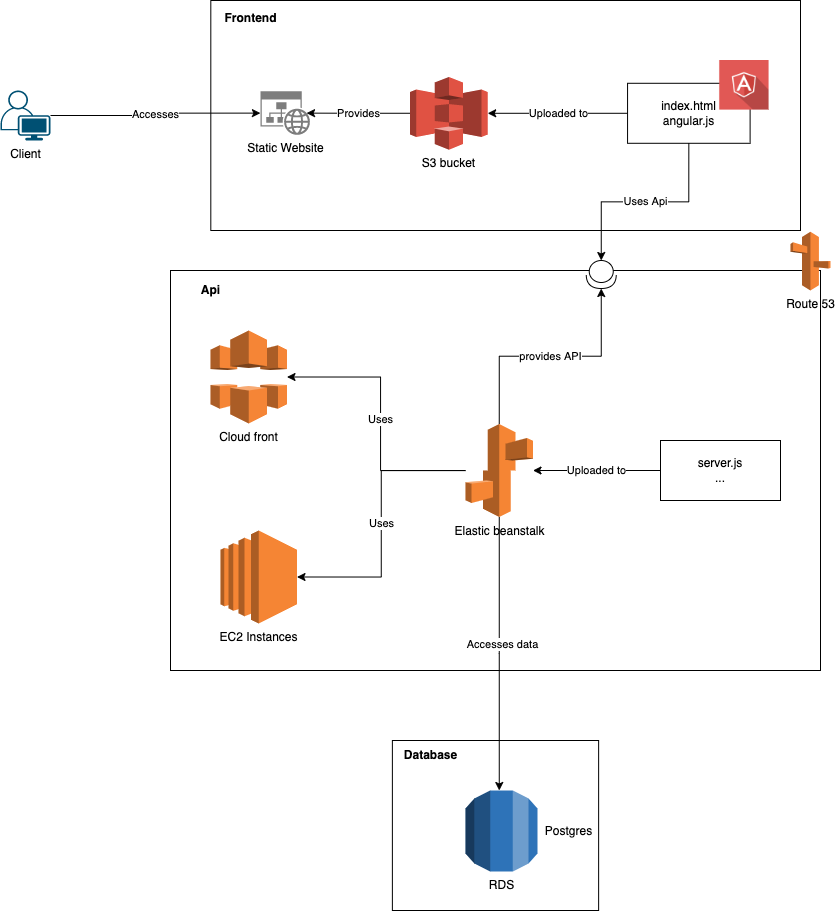

# Infrastructure

The architecture of the application looks as follows

In the AWS console itself, the components:

-   RDS
-   Elastic beanstalk
-   S3

where used.

## Update

A new update is pushed to these systems, when a change is pushed to the cicd pipeline.
After the hold task has been approved, the app is deployed to the components.
