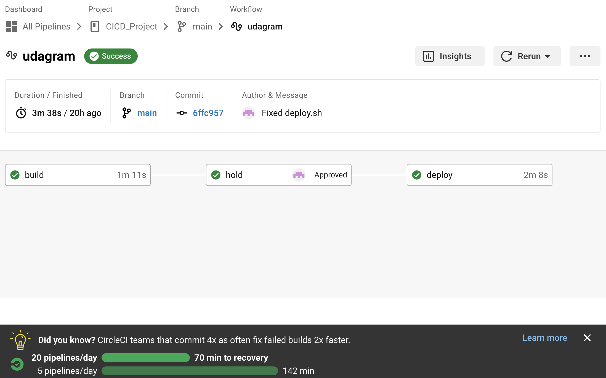

# Pipeline process

The workflow of the pipeline can be seen here:

The workflow consists of 3 elements:

-   build
-   hold
-   deploy

The build job builds the application. If this step is successful, the hold step is triggered, where manually the product owner needs to give his approval for the deployment job.
In the deployment job, the app is deployed to the instances in aws.

## Trigger

The pipeline is triggered, when a new change is pushed to the branch

## Secrets

All secrets are stored in circle ci environment variables:

