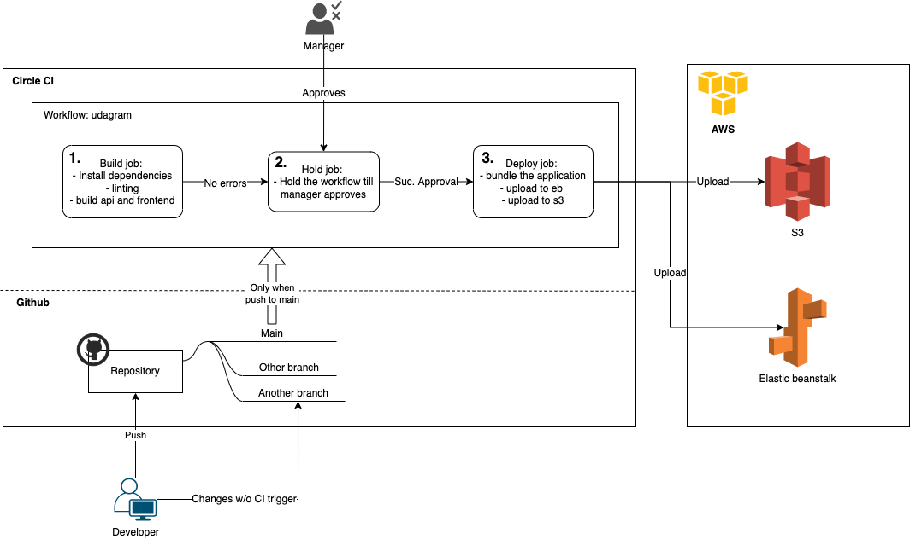

# Pipeline process

The workflow of the pipeline can be seen here:

The workflow consists of 3 elements:

-   build: The build job firstly used to install all dependencies of the frontend and backend. Next, the frontend script is checked with lint for style conformity. In the next step, the frontend and backend scripts are build and packagd into a www folder.
-   hold: The hold job is used to stop the workflow from processing furtherly. This job needs to be approved manually by an manager, so the files get deployed to the main stage. The approval is given in circle ci.
-   deploy: In the deployment script, the applications are installed, packaged and then uploaded to aws. On one side, the api backend is deployed to elastic beanstalk, using the environment variables provided in circle ci. On the other side, the frontend is uploaded to an S3 bucket, with the credentials varaibles provided in cricle ci.

A detailed overview from the pipeline can be seen here:

The build job builds the application. If this step is successful, the hold step is triggered, where manually the product owner needs to give his approval for the deployment job.
In the deployment job, the app is deployed to the instances in aws.

## Trigger

The pipeline is triggered, when a new change is pushed to the branch

## Secrets

All secrets are stored in circle ci environment variables:

